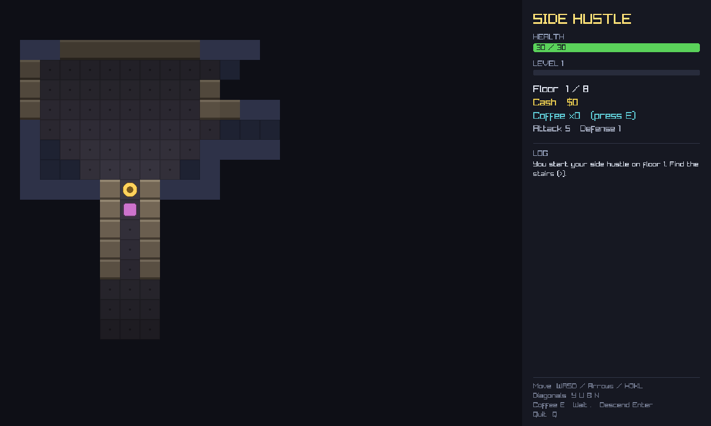

# SIDE HUSTLE

A roguelike written in **modern C++ (C++23)**. You're a freelancer descending a
procedurally generated *corporate dungeon* — fight Bugs, Needy Clients,
Recruiters and Middle Managers, grab cash and coffee, level up, and escape
through eight floors (past the CEO) to go full-time on your side hustle.

It ships in **two front-ends over one shared engine**:

- a **graphical** version (GPU-rendered window via [raylib](https://www.raylib.com/)), and
- a **terminal** version (truecolor ANSI, runs anywhere a terminal does — no deps).



The same `sh::Game` simulation drives both; the front-ends are pure view + input
layers (see `src/game/Game.hpp`'s read-only API and `advance()`).

The terminal version, for comparison:

```
  SIDE HUSTLE — a corporate dungeon crawl
  #######  ############
  #.....#  #..........#
  #.....####..........####      .
  ###....................@M......
HP [##########----------] 18/30   Floor 2   Lvl 2 (xp 4/30)   $44
```

## Build & play

With CMake:

```sh
cmake -B build && cmake --build build
./build/side-hustle
```

Or with the bundled Makefile (no CMake needed):

```sh
make run        # build and play
make selftest   # headless self-play smoke test
```

Requires a C++23 compiler (GCC 13+ or Clang 17+).

### Graphical version (raylib)

The GUI build links **raylib statically**, so on Windows it's a single
self-contained `.exe` (no DLLs). raylib's prebuilt static libs aren't committed —
fetch them once, then build:

```sh
scripts/fetch-raylib.sh     # downloads raylib 5.5 libs into third_party/

make gui                    # -> ./side-hustle-gui      (Linux window)
make windows-gui            # -> ./side-hustle-gui.exe  (Windows, single file)
```

Same controls as below, plus: choose a difficulty on the title screen, and press
**Enter** on the stairs to descend. A virtual-framebuffer smoke test is built in:
`SH_SMOKE=120 ./side-hustle-gui` auto-plays ~120 frames and exits (used to
validate the render loop headlessly).

### Windows

The game is cross-platform — the only OS-specific code is the raw-terminal
layer in `core/Terminal.hpp`, which has a Windows Console backend behind
`#ifdef _WIN32`. Build a native `.exe` two ways:

```sh
# On Windows with MSYS2 / MinGW:
g++ -std=c++23 -O2 -Isrc $(find src -name '*.cpp') -o side-hustle.exe

# Cross-compiling from Linux with mingw-w64:
make windows        # -> ./side-hustle.exe
```

The cross-compiled `.exe` is statically linked, so it's a single self-contained
file that depends only on stock Windows DLLs (`KERNEL32`, `msvcrt`) — just
double-click it or run it from `cmd` / PowerShell. Use a modern terminal
(Windows Terminal, or Windows 10+ conhost) for the ANSI colors.

## Controls

| Keys | Action |
|------|--------|
| `w a s d`, `h j k l`, or arrow keys | Move / bump-to-attack |
| `y u b n` | Move diagonally |
| `e` | Drink a coffee (heals, if you're carrying one) |
| `.` or space | Wait a turn |
| `>` | Descend the stairs (when standing on `>`) |
| `q` | Quit |

Movement is turn-based: every step you take, the monsters take one too. Walk
into a monster to attack it. Find the `>` stairs on each floor to go deeper —
and on the **final floor the CEO (`&`) guards the exit**, so you'll have to get
past it to win.

### Command-line flags

```sh
./side-hustle --easy            # gentler: more HP, fewer/weaker foes
./side-hustle --hard            # brutal: tougher, denser foes
./side-hustle --seed=12345      # reproducible dungeon
./side-hustle --name=ada        # name on the leaderboard
./side-hustle --no-scores       # don't read/write the score file
```

Runs are scored on depth, level and cash (with a bonus for escaping) and saved
to a local `side-hustle-scores.txt` leaderboard shown on the title and
game-over screens.

### What you'll meet

| Glyph | Thing | Notes |
|:-----:|-------|-------|
| `@` | You | Don't let your HP hit zero |
| `b` | Bug | Weak, plentiful |
| `c` | Needy Client | Hits harder |
| `r` | Recruiter | Tough |
| `M` | Middle Manager | The real boss fight |
| `&` | The CEO | Final-floor boss, guards the exit |
| `$` | Cash | Score |
| `!` | Coffee | Stashed in your bag; drink with `e` to heal |
| `/` | Better laptop | Permanent attack upgrade |

## Architecture & the "advanced C++"

The code is split into small, focused translation units under `src/`:

```
src/
├── core/
│   ├── Vec2.hpp        integer 2D vector; defaulted operator<=>, std::hash spec
│   ├── Rng.hpp         seedable std::mt19937_64 wrapper, concept-constrained pick()
│   ├── Grid.hpp        generic Grid<T> constrained by a GridCell concept
│   └── Terminal.hpp    RAII raw-mode terminal guard (restores on scope exit)
├── world/
│   ├── Map.hpp         tiles + visibility flags
│   ├── DungeonGen.*    BSP dungeon generation over a std::unique_ptr tree
│   ├── Fov.*           recursive shadow-casting field of view
│   └── Pathfinding.*   A* with a custom-hashed Vec2 and std::priority_queue
├── game/
│   ├── Components.hpp  data-oriented Entity / Item structs
│   ├── Scores.*        persistent leaderboard (std::filesystem + fstream)
│   └── Game.*          turn loop, combat, progression, rendering, menus
└── main.cpp            arg parsing; interactive vs. --selftest
```

Techniques on display:

- **C++20 concepts** constrain the generic `Grid<T>` (`GridCell`) and the
  `Rng::pick` iterator template (`std::forward_iterator`).
- **RAII** owns the terminal: `Terminal`'s destructor always restores cooked
  mode and the cursor, so a crash or early exit can never leave your shell
  broken.
- **Smart pointers**: the BSP partition tree is built from
  `std::unique_ptr<BspNode>` and frees itself automatically.
- **Defaulted `operator<=>`** gives `Vec2` all its comparisons for free, and a
  `std::hash<Vec2>` specialization lets it key the A* `unordered_map`/`set`.
- **Algorithms & ranges**: `std::clamp`, `std::ranges::count_if`,
  `std::priority_queue`, `<random>` distributions.
- **24-bit "truecolor" renderer** with distance-based FOV light falloff
  (`core/Ansi.hpp` does the RGB lerp/scale math), Unicode shaded walls and a
  box-drawing UI frame, plus a gradient HP bar. Best in a truecolor terminal
  (most modern ones, incl. Windows Terminal); UTF-8 output is handled per-OS.
- **`std::filesystem` + `std::fstream`** persist the high-score table, with a
  round-tripping text format and graceful handling of a missing/corrupt file.
- **`std::format`** builds every HUD, menu and log line; **designated
  initializers** populate score records.
- Classic game-AI algorithms implemented from scratch: **BSP** level
  generation, **recursive shadow-casting FOV**, and **A\*** monster pathfinding.

## Headless self-test

`./side-hustle --selftest [--seed=N]` runs the full simulation with no terminal:
it auto-paths the player toward the stairs floor by floor (exercising
generation, FOV, A\*, combat and progression), prints a per-floor report and an
ASCII map snapshot, and exits. Handy as a CI smoke test that the engine builds
and runs end-to-end.
